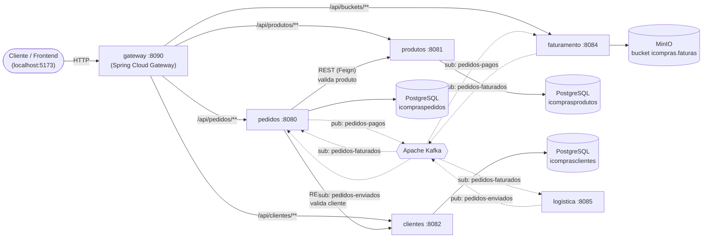
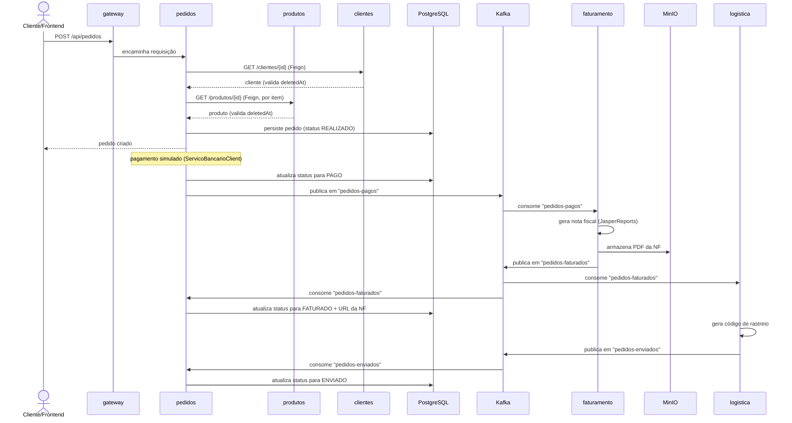

# icompras


Plataforma de e-commerce baseada em **microserviços**, construída como um monorepo Maven multi-módulo em Java/Spring Boot. Cobre o fluxo completo de um pedido — cadastro de clientes e produtos, criação e validação de pedidos, faturamento com emissão de nota fiscal e logística de envio — combinando comunicação **síncrona (REST/OpenFeign)** e **assíncrona (Apache Kafka)** entre os serviços.

## Sumário

- [Arquitetura](#arquitetura)
  - [Visão geral dos serviços](#visão-geral-dos-serviços)
  - [Diagrama de arquitetura](#diagrama-de-arquitetura)
  - [Comunicação síncrona](#comunicação-síncrona-rest--openfeign)
  - [Comunicação assíncrona](#comunicação-assíncrona-apache-kafka)
  - [Fluxo de um pedido](#fluxo-de-um-pedido)
  - [Persistência](#persistência)
- [Stack tecnológica](#stack-tecnológica)
- [Como subir o projeto](#como-subir-o-projeto)
  - [Pré-requisitos](#pré-requisitos)
  - [Subindo com Docker Compose](#subindo-com-docker-compose)
  - [Portas expostas](#portas-expostas)
  - [Documentação das APIs (Swagger)](#documentação-das-apis-swagger)
  - [Ferramentas de infraestrutura](#ferramentas-de-infraestrutura)
- [Rodando localmente sem Docker](#rodando-localmente-sem-docker)

## Arquitetura

### Visão geral dos serviços

| Serviço | Porta | Responsabilidade | Persistência |
|---|---|---|---|
| `gateway` | 8090 | API Gateway (Spring Cloud Gateway/WebFlux) — roteamento e CORS | — |
| `pedidos` | 8080 | Núcleo do domínio: criação, validação e ciclo de vida do pedido | PostgreSQL (`icompraspedidos`) |
| `produtos` | 8081 | Catálogo de produtos (CRUD) | PostgreSQL (`icomprasprodutos`) |
| `clientes` | 8082 | Cadastro de clientes (CRUD) | PostgreSQL (`icomprasclientes`) |
| `faturamento` | 8084 | Geração de nota fiscal (PDF via JasperReports) após pagamento | MinIO (arquivos) |
| `logistica` | 8085 | Simulação de envio e código de rastreio | — (stateless) |
| `common` | — | Biblioteca compartilhada (enums, exceptions, entidade base auditável) | — |

Não há service discovery (Eureka/Consul): o roteamento é estático, resolvido por perfil Spring (`default` usa `localhost`, `docker` usa os nomes dos serviços na rede do Compose).

### Diagrama de arquitetura



Linhas **sólidas** = comunicação síncrona (REST/HTTP). Linhas **tracejadas** = comunicação assíncrona (eventos Kafka).

### Comunicação síncrona (REST / OpenFeign)

- **gateway → serviços**: roteamento HTTP puro via Spring Cloud Gateway, sem lógica de negócio.
- **pedidos → clientes** e **pedidos → produtos**: únicas chamadas REST diretas entre microserviços do sistema, feitas via [OpenFeign](https://docs.spring.io/spring-cloud-openfeign/reference/) (`ClienteClient`, `ProdutoClient`). Antes de criar um pedido, o `PedidoValidator` consulta cliente e produtos e **rejeita a criação se algum estiver inativo/excluído** (`deletedAt != null` — soft delete), retornando erro de negócio. Timeout/indisponibilidade do serviço chamado também é tratado como erro de negócio (`*.service.unavailable`).
- Os demais serviços (`produtos`, `clientes`, `faturamento`, `logistica`) não fazem chamadas HTTP para outros microserviços — toda a integração deles é via Kafka.

### Comunicação assíncrona (Apache Kafka)

Coreografia de eventos (sem orquestrador central), sem DLQ/retry configurado — mensageria *best-effort*:

| Producer | Tópico | Consumer(s) | Payload / efeito |
|---|---|---|---|
| `pedidos` | `icompras.pedidos-pagos` | `faturamento` | Snapshot do pedido pago + dados do cliente → dispara geração da nota fiscal |
| `faturamento` | `icompras.pedidos-faturados` | `logistica`, `pedidos` | Status `FATURADO` + URL da NF no MinIO → dispara envio e atualiza o pedido |
| `logistica` | `icompras.pedidos-enviados` | `pedidos` | Código de rastreio → atualiza status do pedido para `ENVIADO` |

Ciclo de vida do pedido (`PedidoStatus`):

```
REALIZADO → PAGO → FATURADO → PREPARANDO_ENVIO → ENVIADO → ENTREGUE
                 ↘ ERRO_PAGAMENTO
```

### Fluxo de um pedido



### Persistência

- **Database per service**: uma única instância PostgreSQL hospeda três bancos lógicos isolados — `icomprasprodutos`, `icompraspedidos`, `icomprasclientes` — inicializados por scripts SQL simples (`servicos/database/01-schema.sql` e `02-seed.sql`, sem Flyway/Liquibase; `hibernate.ddl-auto: none`).
- `faturamento` e `logistica` não possuem banco relacional — são processadores de eventos stateless. O `faturamento` persiste os PDFs de nota fiscal gerados no **MinIO** (bucket `icompras.faturas`).

## Stack tecnológica

- **Java 21** + **Spring Boot** (Web MVC / WebFlux)
- **Spring Cloud Gateway** (roteamento reativo + CORS)
- **Spring Data JPA** + **PostgreSQL**
- **OpenFeign** (comunicação síncrona entre serviços)
- **Apache Kafka** (Confluent images) + **Kafka UI**
- **MinIO** (armazenamento de objetos)
- **JasperReports** (geração de PDF da nota fiscal)
- **springdoc-openapi** (documentação/Swagger UI)
- **Maven** (multi-módulo) + **Docker / Docker Compose**

## Como subir o projeto

### Pré-requisitos

- [Docker](https://docs.docker.com/get-docker/) e Docker Compose (plugin `docker compose`)
- Java 21 e Maven — **apenas** se for rodar algum serviço fora do Docker (veja [Rodando localmente sem Docker](#rodando-localmente-sem-docker))

### Subindo com Docker Compose

Todo o stack (banco, broker, storage e os 6 microserviços) sobe com um único comando a partir da raiz do repositório:

```bash
docker compose up --build -d
```

O `docker-compose.yaml` usa um único `Dockerfile` multi-stage na raiz, com um estágio (`target`) por serviço (`produtos`, `clientes`, `pedidos`, `faturamento`, `logistica`, `gateway`). Os `depends_on` com `condition: service_healthy` garantem que Postgres, Kafka e MinIO estejam prontos antes de os serviços Java subirem.

Para acompanhar os logs:

```bash
docker compose logs -f
```

Para derrubar o ambiente:

```bash
docker compose down
```

> Para buildar/rodar apenas um serviço específico da imagem multi-stage: `docker build --target pedidos -t icompras-pedidos .`

### Portas expostas

| Porta | Serviço |
|---|---|
| 5432 | PostgreSQL |
| 2181 | Zookeeper |
| 29092 | Kafka (listener externo) |
| 8083 | Kafka UI |
| 9000 / 9001 | MinIO (API / Console) |
| 8080 | pedidos |
| 8081 | produtos |
| 8082 | clientes |
| 8084 | faturamento |
| 8085 | logistica |
| 8090 | gateway |

### Documentação das APIs (Swagger)

Cada serviço com API REST expõe Swagger UI via `springdoc-openapi` em `/swagger-ui/index.html`:

- pedidos: http://localhost:8080/swagger-ui/index.html
- produtos: http://localhost:8081/swagger-ui/index.html
- clientes: http://localhost:8082/swagger-ui/index.html
- faturamento: http://localhost:8084/swagger-ui/index.html

Também é possível acessar `pedidos`, `produtos` e `clientes` através do gateway, prefixando as rotas com `/api/pedidos`, `/api/produtos` e `/api/clientes` em `http://localhost:8090`.

### Ferramentas de infraestrutura

| Ferramenta | URL | Credenciais |
|---|---|---|
| Kafka UI | http://localhost:8083 | — |
| MinIO Console | http://localhost:9001 | `minioadmin` / `minioadmin` |
| PostgreSQL | `localhost:5432` | `postgres` / `123456` |

## Rodando localmente sem Docker

É possível subir apenas a infraestrutura pelo Compose e rodar os serviços Java diretamente pela IDE/Maven (perfil `default`, que aponta para `localhost` em vez dos nomes de serviço do Docker):

```bash
docker compose up -d postgres zookeeper kafka minio
```

Em seguida, execute cada módulo desejado (`pedidos`, `produtos`, `clientes`, `faturamento`, `logistica`, `gateway`) normalmente via Maven (`mvn spring-boot:run` dentro da pasta do módulo) ou pela sua IDE.
